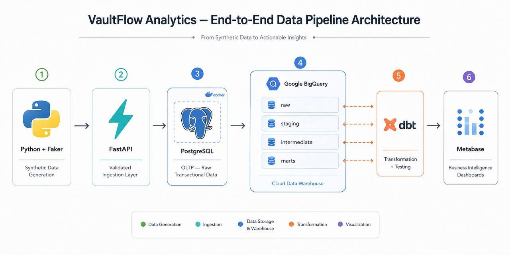
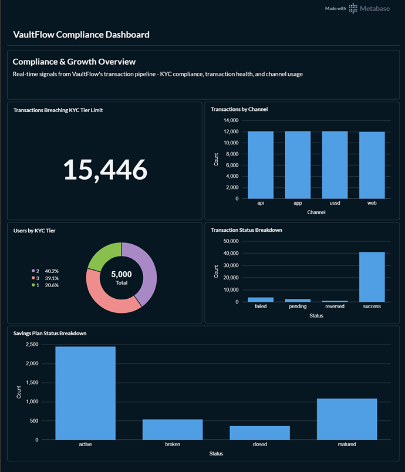
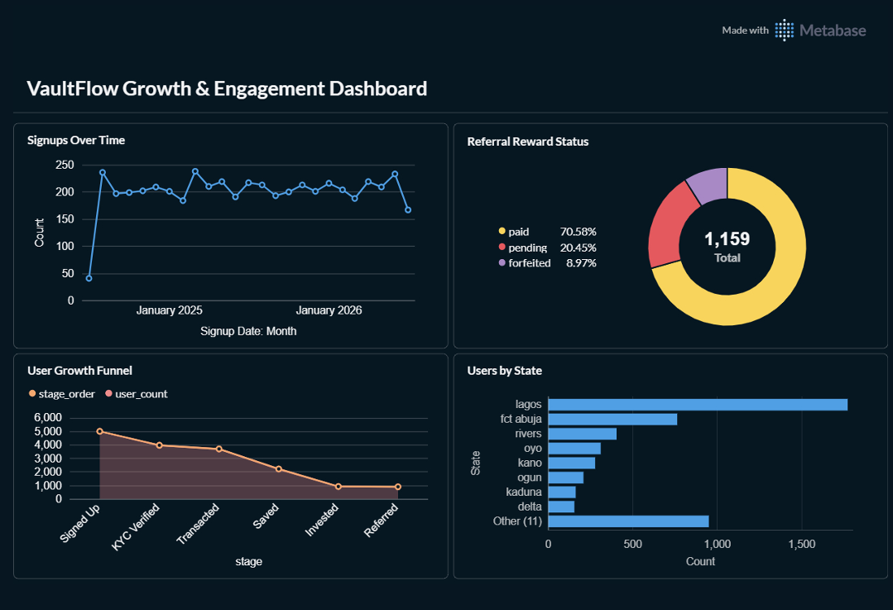

# VaultFlow Analytics

VaultFlow is a simulated Nigerian fintech savings and investment platform, modeled after how companies like Cowrywise and Piggyvest operate. This project builds a complete data pipeline that takes messy, regulation-bound transaction data and turns it into a tested, trustworthy analytics layer, usable for both business decisions and compliance review.

## The Problem

Nigerian fintechs generate high volumes of transactional data that must satisfy two different audiences at once. A business team needs to know if the platform is actually growing. A compliance reviewer needs to trust that the numbers hold up against CBN regulations. Raw, unmodeled data cannot reliably answer either question. VaultFlow closes that gap by building the full pipeline needed to make the data trustworthy for both.

## Architecture

Python (Faker) generates synthetic data. FastAPI validates and ingests it. PostgreSQL stores it as raw transactional data. That data is loaded into Google BigQuery, where dbt transforms it through four layers: raw, staging, intermediate, and marts. Metabase connects to the marts layer to build dashboards.

## Key Engineering Decisions

**KYC tier is calculated by the backend, never submitted by the user.** Early in development, the API accepted a tier value directly from the client. This was a trust boundary problem: nothing stopped a user from claiming a higher tier than they'd actually earned. The fix moves tier calculation into the backend itself, based only on whether a user has a verified BVN and NIN on file.

**Referential integrity is enforced at the database level.** The referral data intentionally includes some invalid rows, including self-referrals and references to users who don't exist. PostgreSQL's foreign key constraints correctly reject these. Of 1,202 referral rows generated, 43 were rejected for violating referential integrity.

**Data volumes follow a realistic funnel, not flat row counts.** Starting from 5,000 signups, the population narrows at each stage: KYC verification, making a transaction, opening a savings plan, investing, and referring a friend. This mirrors real product adoption, where fewer users complete each successive step.

**A compliance signal is built directly into the intermediate layer.** The model `int_transactions_with_kyc_check` joins transactions to users and flags any transaction that exceeds what that user's KYC tier should allow. This turns raw transaction data into a concrete, actionable compliance signal.

**dbt tests enforce data quality automatically.** Uniqueness, not-null, and relationship tests run across the marts layer, catching problems like duplicate IDs or broken foreign key relationships before they reach a dashboard.

## Dashboards

### Compliance Dashboard
Tracks KYC tier limit breaches, transaction status health, channel usage, and savings plan status.

### Growth & Engagement Dashboard
Tracks signup trends, the user growth funnel, referral outcomes, and geographic distribution across Nigerian states.

## Tech Stack

Python, FastAPI, PostgreSQL, Docker, Google BigQuery, dbt, Metabase

## Setup

1. `docker compose up -d` starts PostgreSQL and Metabase.
2. `python data_generator/generate_*.py` generates and inserts synthetic data.
3. `uvicorn api.main:app --reload` runs the FastAPI backend.
4. `python ingestion/postgres_to_bigquery.py` loads raw data into BigQuery.
5. `dbt run` (from `dbt_project/vaultflow`) builds the staging, intermediate, and marts models.
6. `dbt test` runs the data quality tests.